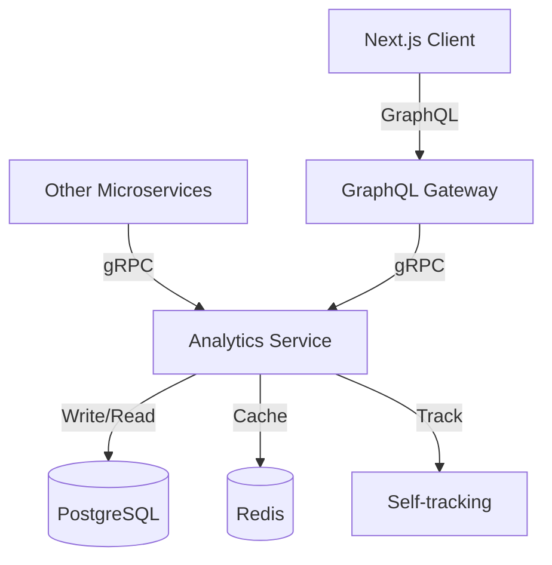

# Analytics Service Design Document

## Overview

The Analytics Service is a Go-based microservice that provides event tracking and user identification capabilities for the HAUNTED SAAS SKELETON platform. It acts as an abstraction layer similar to Mixpanel or Amplitude, allowing other services to track user behavior and system events. The service exposes gRPC endpoints for internal communication and integrates with the GraphQL Gateway for client-side tracking.

The service follows a layered architecture with clear separation between the API layer (gRPC handlers), business logic layer (service), and data access layer (repository). It uses PostgreSQL for persistent storage and Redis for caching and session management.

## Architecture

### High-Level Architecture



### Service Structure

```
analytics-service/
├── cmd/
│   └── server/
│       └── main.go                 # Service entry point
├── internal/
│   ├── api/
│   │   └── grpc/
│   │       ├── handler.go          # gRPC handler implementation
│   │       └── middleware.go       # Logging, tracing, rate limiting
│   ├── service/
│   │   ├── analytics.go            # Business logic
│   │   └── validation.go           # Input validation
│   ├── repository/
│   │   ├── postgres/
│   │   │   ├── events.go           # Event persistence
│   │   │   └── users.go            # User identity persistence
│   │   └── redis/
│   │       └── cache.go            # Caching layer
│   ├── models/
│   │   ├── event.go                # Event domain model
│   │   └── user.go                 # User identity domain model
│   └── config/
│       └── config.go               # Configuration management
├── proto/
│   └── analytics/
│       └── v1/
│           └── analytics.proto     # gRPC service definition
├── migrations/
│   ├── 001_create_events_table.sql
│   └── 002_create_users_table.sql
├── Dockerfile
└── go.mod
```

## Components and Interfaces

### gRPC Service Definition

```protobuf
syntax = "proto3";

package analytics.v1;

option go_package = "github.com/haunted-saas/analytics-service/proto/analytics/v1";

service AnalyticsService {
  rpc TrackEvent(TrackEventRequest) returns (TrackEventResponse);
  rpc IdentifyUser(IdentifyUserRequest) returns (IdentifyUserResponse);
  rpc GetEventCount(GetEventCountRequest) returns (GetEventCountResponse);
  rpc GetUserCount(GetUserCountRequest) returns (GetUserCountResponse);
  rpc HealthCheck(HealthCheckRequest) returns (HealthCheckResponse);
}

message TrackEventRequest {
  string event_name = 1;
  string user_id = 2;  // Optional, empty for anonymous events
  map<string, PropertyValue> properties = 3;
  int64 timestamp = 4;  // Unix timestamp, optional
}

message PropertyValue {
  oneof value {
    string string_value = 1;
    double number_value = 2;
    bool bool_value = 3;
  }
}

message TrackEventResponse {
  bool success = 1;
  string event_id = 2;
}

message IdentifyUserRequest {
  string user_id = 1;
  map<string, PropertyValue> properties = 2;
}

message IdentifyUserResponse {
  bool success = 1;
}

message GetEventCountRequest {
  string event_name = 1;  // Optional, empty for all events
  int64 start_time = 2;
  int64 end_time = 3;
  string group_by = 4;  // "hour", "day", "week"
}

message GetEventCountResponse {
  repeated EventCount counts = 1;
}

message EventCount {
  string event_name = 1;
  int64 timestamp = 2;
  int64 count = 3;
}

message GetUserCountRequest {
  int64 start_time = 1;
  int64 end_time = 2;
}

message GetUserCountResponse {
  int64 unique_users = 1;
}

message HealthCheckRequest {}

message HealthCheckResponse {
  string status = 1;
}
```

### Core Interfaces

```go
// Service layer interface
type AnalyticsService interface {
    TrackEvent(ctx context.Context, event *Event) (string, error)
    IdentifyUser(ctx context.Context, userID string, properties map[string]interface{}) error
    GetEventCount(ctx context.Context, filter EventFilter) ([]EventCount, error)
    GetUserCount(ctx context.Context, startTime, endTime time.Time) (int64, error)
}

// Repository interfaces
type EventRepository interface {
    Create(ctx context.Context, event *Event) error
    GetCount(ctx context.Context, filter EventFilter) ([]EventCount, error)
}

type UserRepository interface {
    Upsert(ctx context.Context, user *UserIdentity) error
    GetUserCount(ctx context.Context, startTime, endTime time.Time) (int64, error)
}

type CacheRepository interface {
    Get(ctx context.Context, key string) (interface{}, error)
    Set(ctx context.Context, key string, value interface{}, ttl time.Duration) error
    Delete(ctx context.Context, key string) error
}
```

## Data Models

### PostgreSQL Schema

```sql
-- Events table
CREATE TABLE events (
    id UUID PRIMARY KEY DEFAULT gen_random_uuid(),
    event_name VARCHAR(255) NOT NULL,
    user_id VARCHAR(255),
    properties JSONB,
    timestamp TIMESTAMPTZ NOT NULL DEFAULT NOW(),
    created_at TIMESTAMPTZ NOT NULL DEFAULT NOW()
);

CREATE INDEX idx_events_user_id ON events(user_id);
CREATE INDEX idx_events_event_name ON events(event_name);
CREATE INDEX idx_events_timestamp ON events(timestamp);
CREATE INDEX idx_events_properties ON events USING GIN(properties);

-- User identities table
CREATE TABLE user_identities (
    user_id VARCHAR(255) PRIMARY KEY,
    properties JSONB,
    first_seen TIMESTAMPTZ NOT NULL DEFAULT NOW(),
    last_seen TIMESTAMPTZ NOT NULL DEFAULT NOW(),
    updated_at TIMESTAMPTZ NOT NULL DEFAULT NOW()
);

CREATE INDEX idx_user_identities_properties ON user_identities USING GIN(properties);
```

### Go Domain Models

```go
type Event struct {
    ID         string
    EventName  string
    UserID     string
    Properties map[string]interface{}
    Timestamp  time.Time
    CreatedAt  time.Time
}

type UserIdentity struct {
    UserID     string
    Properties map[string]interface{}
    FirstSeen  time.Time
    LastSeen   time.Time
    UpdatedAt  time.Time
}

type EventFilter struct {
    EventName string
    StartTime time.Time
    EndTime   time.Time
    GroupBy   string
}

type EventCount struct {
    EventName string
    Timestamp time.Time
    Count     int64
}
```

## Error Handling

### Error Types

```go
var (
    ErrInvalidEventName    = errors.New("invalid event name")
    ErrInvalidUserID       = errors.New("invalid user ID")
    ErrInvalidProperties   = errors.New("invalid properties")
    ErrPayloadTooLarge     = errors.New("payload exceeds maximum size")
    ErrInvalidTimeRange    = errors.New("invalid time range")
    ErrDatabaseUnavailable = errors.New("database unavailable")
    ErrRateLimitExceeded   = errors.New("rate limit exceeded")
)
```

### Error Handling Strategy

1. **Validation Errors**: Return immediately with descriptive error messages
2. **Database Errors**: Log error details, attempt retry with exponential backoff (up to 5 attempts)
3. **Cache Errors**: Log warning but continue operation (cache is not critical)
4. **Rate Limit Errors**: Return error to caller with retry-after information
5. **Panic Recovery**: Middleware catches panics, logs stack trace, returns internal error

### Retry Logic

```go
func (r *PostgresEventRepository) CreateWithRetry(ctx context.Context, event *Event) error {
    backoff := time.Second
    maxRetries := 5
    
    for i := 0; i < maxRetries; i++ {
        err := r.Create(ctx, event)
        if err == nil {
            return nil
        }
        
        if !isRetryableError(err) {
            return err
        }
        
        time.Sleep(backoff)
        backoff *= 2
    }
    
    return ErrDatabaseUnavailable
}
```

## Testing Strategy

### Unit Tests

- **Service Layer**: Mock repository interfaces, test business logic
- **Repository Layer**: Use testcontainers for PostgreSQL and Redis
- **Validation**: Test all validation rules with table-driven tests
- **Error Handling**: Test retry logic, error propagation

### Integration Tests

- **gRPC Handlers**: Test full request/response cycle with test server
- **Database Operations**: Test CRUD operations with real PostgreSQL
- **Cache Operations**: Test cache hit/miss scenarios with real Redis
- **End-to-End**: Test complete flow from gRPC call to database persistence

### Performance Tests

- **Load Testing**: Simulate 10,000 events/second
- **Latency Testing**: Verify p95 latency < 100ms
- **Cache Effectiveness**: Measure cache hit rate > 80%

### Test Structure

```go
func TestAnalyticsService_TrackEvent(t *testing.T) {
    tests := []struct {
        name    string
        event   *Event
        wantErr bool
        errType error
    }{
        {
            name: "valid event with user",
            event: &Event{
                EventName: "page_view",
                UserID:    "user123",
                Properties: map[string]interface{}{
                    "page": "/dashboard",
                },
            },
            wantErr: false,
        },
        {
            name: "anonymous event",
            event: &Event{
                EventName: "page_view",
                Properties: map[string]interface{}{
                    "page": "/landing",
                },
            },
            wantErr: false,
        },
        {
            name: "invalid event name",
            event: &Event{
                EventName: "",
                UserID:    "user123",
            },
            wantErr: true,
            errType: ErrInvalidEventName,
        },
    }
    
    for _, tt := range tests {
        t.Run(tt.name, func(t *testing.T) {
            // Test implementation
        })
    }
}
```

## Configuration

### Environment Variables

```
# Service
SERVICE_PORT=50051
SERVICE_NAME=analytics-service
LOG_LEVEL=info

# PostgreSQL
POSTGRES_HOST=localhost
POSTGRES_PORT=5432
POSTGRES_DB=analytics
POSTGRES_USER=analytics
POSTGRES_PASSWORD=secret
POSTGRES_MAX_CONNECTIONS=25

# Redis
REDIS_HOST=localhost
REDIS_PORT=6379
REDIS_PASSWORD=
REDIS_DB=0
REDIS_CACHE_TTL=300

# Rate Limiting
RATE_LIMIT_EVENTS_PER_USER_PER_MINUTE=1000

# Observability
PROMETHEUS_PORT=9090
OTEL_EXPORTER_OTLP_ENDPOINT=http://localhost:4317
```

## Security Considerations

1. **Input Sanitization**: All properties are sanitized to prevent SQL injection
2. **PII Encryption**: Sensitive user properties are encrypted at rest using AES-256
3. **Rate Limiting**: Token bucket algorithm limits events per user
4. **Authentication**: Verify calling service identity via mTLS
5. **Audit Logging**: Log all IdentifyUser calls with user ID and timestamp

## Performance Optimizations

1. **Batch Inserts**: Buffer events and insert in batches of 100
2. **Connection Pooling**: Maintain pool of 25 PostgreSQL connections
3. **Redis Caching**: Cache aggregation queries with 5-minute TTL
4. **Async Processing**: Process non-critical operations asynchronously
5. **Database Indexes**: Optimize queries with appropriate indexes
