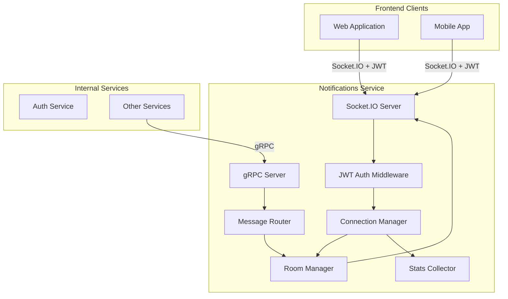

# Design Document: Notifications Service

## Overview

The Notifications Service manages all real-time communication for the Haunted SaaS Skeleton platform, serving as the Liveness Layer. It uses Socket.IO to provide WebSocket connections with automatic HTTP long-polling fallback for network-restricted environments. The service authenticates connections using JWT, manages user and team rooms, and exposes gRPC endpoints for other backend services to push real-time messages.

## Architecture

### High-Level Architecture



### Technology Stack

- **Language**: Go 1.21+
- **Socket.IO**: github.com/googollee/go-socket.io
- **gRPC Framework**: google.golang.org/grpc
- **JWT**: github.com/golang-jwt/jwt/v5
- **Configuration**: Environment variables via godotenv
- **Logging**: Structured logging with zerolog
- **Metrics**: Prometheus client for Go

## Components and Interfaces

### 1. gRPC Service Definition

```protobuf
syntax = "proto3";

package notifications.v1;

service NotificationsService {
  rpc SendToUser(SendToUserRequest) returns (SendToUserResponse);
  rpc SendToUsers(SendToUsersRequest) returns (SendToUsersResponse);
  rpc BroadcastToRoom(BroadcastToRoomRequest) returns (BroadcastToRoomResponse);
  rpc IsUserConnected(IsUserConnectedRequest) returns (IsUserConnectedResponse);
  rpc GetConnectionStats(GetConnectionStatsRequest) returns (GetConnectionStatsResponse);
  rpc DisconnectUser(DisconnectUserRequest) returns (DisconnectUserResponse);
}

message SendToUserRequest {
  string user_id = 1;
  string event_type = 2;
  string payload_json = 3;
  string correlation_id = 4;
}

message SendToUserResponse {
  bool delivered = 1;
  int32 connection_count = 2;
}

message SendToUsersRequest {
  repeated string user_ids = 1;
  string event_type = 2;
  string payload_json = 3;
  string correlation_id = 4;
}

message SendToUsersResponse {
  int32 total_users = 1;
  int32 delivered_count = 2;
  map<string, int32> connections_by_user = 3;
}

message BroadcastToRoomRequest {
  string room_id = 1; // Typically team_id
  string event_type = 2;
  string payload_json = 3;
  string correlation_id = 4;
  repeated string exclude_user_ids = 5; // Optional
}

message BroadcastToRoomResponse {
  bool delivered = 1;
  int32 recipient_count = 2;
}

message IsUserConnectedRequest {
  string user_id = 1;
}

message IsUserConnectedResponse {
  bool is_connected = 1;
  int32 connection_count = 2;
  repeated string socket_ids = 3;
}

message GetConnectionStatsRequest {
  string team_id = 1; // Optional filter
}

message GetConnectionStatsResponse {
  int32 total_connections = 1;
  int32 websocket_connections = 2;
  int32 polling_connections = 3;
  map<string, int32> connections_by_team = 4;
  map<string, int32> connections_by_transport = 5;
}

message DisconnectUserRequest {
  string user_id = 1;
  string reason = 2;
}

message DisconnectUserResponse {
  int32 disconnected_count = 1;
}
```

### 2. Socket.IO Server Setup

```go
type SocketIOServer struct {
    server          *socketio.Server
    connManager     *ConnectionManager
    roomManager     *RoomManager
    authMiddleware  *AuthMiddleware
    logger          *zerolog.Logger
}

func NewSocketIOServer(config *Config) (*SocketIOServer, error) {
    server := socketio.NewServer(&engineio.Options{
        Transports: []transport.Transport{
            &websocket.Transport{
                CheckOrigin: allowOrigin,
            },
            &polling.Transport{
                CheckOrigin: allowOrigin,
            },
        },
        PingTimeout:  60 * time.Second,
        PingInterval: 25 * time.Second,
    })
    
    // Register event handlers
    server.OnConnect("/", onConnect)
    server.OnDisconnect("/", onDisconnect)
    server.OnError("/", onError)
    
    return &SocketIOServer{
        server: server,
        // ... initialize other components
    }
}

func (s *SocketIOServer) Start(port int) error
func (s *SocketIOServer) Stop() error
```

### 3. JWT Authentication Middleware

```go
type AuthMiddleware struct {
    jwtSecret []byte
    logger    *zerolog.Logger
}

type JWTClaims struct {
    UserID string `json:"user_id"`
    TeamID string `json:"team_id"`
    Email  string `json:"email"`
    jwt.RegisteredClaims
}

func (m *AuthMiddleware) Authenticate(conn socketio.Conn) (*JWTClaims, error) {
    // 1. Extract token from handshake query or headers
    // 2. Parse and validate JWT
    // 3. Check expiration
    // 4. Extract claims
    // 5. Return user info or error
}

func (m *AuthMiddleware) extractToken(conn socketio.Conn) (string, error)
func (m *AuthMiddleware) validateToken(tokenString string) (*JWTClaims, error)
```

### 4. Connection Manager

```go
type ConnectionManager struct {
    mu          sync.RWMutex
    connections map[string]*Connection // socket_id -> Connection
    userConns   map[string][]string    // user_id -> []socket_id
    logger      *zerolog.Logger
}

type Connection struct {
    SocketID    string
    UserID      string
    TeamID      string
    Transport   string // "websocket" or "polling"
    ConnectedAt time.Time
    LastSeen    time.Time
    Metadata    map[string]string
}

func (m *ConnectionManager) AddConnection(conn *Connection) error
func (m *ConnectionManager) RemoveConnection(socketID string) error
func (m *ConnectionManager) GetUserConnections(userID string) []*Connection
func (m *ConnectionManager) IsUserConnected(userID string) bool
func (m *ConnectionManager) GetConnectionCount() int
func (m *ConnectionManager) GetConnectionsByTransport() map[string]int
func (m *ConnectionManager) UpdateLastSeen(socketID string)
```

### 5. Room Manager

```go
type RoomManager struct {
    mu      sync.RWMutex
    rooms   map[string]*Room // room_id -> Room
    server  *socketio.Server
    logger  *zerolog.Logger
}

type Room struct {
    ID          string
    Type        string // "user", "team", "custom"
    Members     map[string]bool // socket_id -> true
    CreatedAt   time.Time
}

func (m *RoomManager) JoinRoom(socketID, roomID string) error
func (m *RoomManager) LeaveRoom(socketID, roomID string) error
func (m *RoomManager) LeaveAllRooms(socketID string) error
func (m *RoomManager) GetRoomMembers(roomID string) []string
func (m *RoomManager) GetRoomCount() int
func (m *RoomManager) EmitToRoom(roomID, eventType string, payload interface{}) error
func (m *RoomManager) EmitToRoomExcept(roomID, eventType string, payload interface{}, excludeSocketIDs []string) error
```

### 6. Message Router

```go
type MessageRouter struct {
    connManager *ConnectionManager
    roomManager *RoomManager
    server      *socketio.Server
    logger      *zerolog.Logger
}

func (r *MessageRouter) SendToUser(ctx context.Context, userID, eventType string, payload interface{}) error {
    // 1. Get user's socket connections
    // 2. Emit to user's room
    // 3. Log delivery
    // 4. Return result
}

func (r *MessageRouter) SendToUsers(ctx context.Context, userIDs []string, eventType string, payload interface{}) error {
    // 1. Iterate through user IDs
    // 2. Send to each user in parallel
    // 3. Collect results
    // 4. Return aggregated result
}

func (r *MessageRouter) BroadcastToRoom(ctx context.Context, roomID, eventType string, payload interface{}, excludeUserIDs []string) error {
    // 1. Get room members
    // 2. Filter excluded users
    // 3. Emit to room
    // 4. Log broadcast
    // 5. Return result
}

func (r *MessageRouter) emitToSocket(socketID, eventType string, payload interface{}) error
```

### 7. Stats Collector

```go
type StatsCollector struct {
    connManager *ConnectionManager
    roomManager *RoomManager
    startTime   time.Time
    mu          sync.RWMutex
    metrics     *Metrics
}

type Metrics struct {
    TotalConnections      int64
    TotalDisconnections   int64
    TotalMessagesDelivered int64
    MessagesByEventType   map[string]int64
    ConnectionsByTeam     map[string]int32
}

func (c *StatsCollector) GetStats(teamFilter string) *ConnectionStats
func (c *StatsCollector) IncrementMessageCount(eventType string)
func (c *StatsCollector) RecordConnection(transport string)
func (c *StatsCollector) RecordDisconnection()
```

## Data Models

### In-Memory Data Structures

No persistent database is required. All state is maintained in memory:

```go
// Connection tracking
connections := make(map[string]*Connection)
userConns := make(map[string][]string)

// Room membership
rooms := make(map[string]*Room)

// Stats
metrics := &Metrics{
    MessagesByEventType: make(map[string]int64),
    ConnectionsByTeam:   make(map[string]int32),
}
```

### Message Format

Messages sent to clients follow a consistent structure:

```json
{
  "event": "notification",
  "data": {
    "id": "msg_123",
    "type": "alert",
    "title": "New Message",
    "body": "You have a new message from Alice",
    "timestamp": "2024-01-15T10:30:00Z",
    "metadata": {
      "sender_id": "user_456",
      "priority": "high"
    }
  }
}
```

## Error Handling

### Error Types

```go
type NotificationError struct {
    Code    string
    Message string
    Cause   error
}

const (
    ErrCodeAuthFailed          = "AUTH_FAILED"
    ErrCodeInvalidToken        = "INVALID_TOKEN"
    ErrCodeUserNotConnected    = "USER_NOT_CONNECTED"
    ErrCodeRoomNotFound        = "ROOM_NOT_FOUND"
    ErrCodeInvalidEventType    = "INVALID_EVENT_TYPE"
    ErrCodeDeliveryFailed      = "DELIVERY_FAILED"
    ErrCodeConnectionLimitReached = "CONNECTION_LIMIT_REACHED"
)
```

### Error Handling Strategy

1. **Authentication Errors**
   - Reject connection immediately
   - Log authentication failure with IP
   - Return clear error message to client

2. **Connection Errors**
   - Log error with socket ID and reason
   - Clean up connection state
   - Notify monitoring system

3. **Message Delivery Errors**
   - Log failed delivery attempts
   - Return success to caller (fire-and-forget)
   - Track delivery failures in metrics

4. **Room Management Errors**
   - Log room operation failures
   - Continue processing other operations
   - Return partial success when applicable

### Logging Strategy

```go
type LogEntry struct {
    Level         string
    Message       string
    SocketID      string
    UserID        string
    TeamID        string
    EventType     string
    Transport     string
    CorrelationID string
    Error         error
    Timestamp     time.Time
}

// Log levels:
// - INFO: Connections, disconnections, message delivery
// - WARN: Authentication failures, rate limit hits
// - ERROR: System errors, delivery failures
// - DEBUG: Detailed flow (development only)
```

## Testing Strategy

### Unit Tests

1. **Connection Manager Tests**
   - Test adding/removing connections
   - Test user connection lookup
   - Test concurrent access
   - Test connection stats

2. **Room Manager Tests**
   - Test joining/leaving rooms
   - Test room membership tracking
   - Test message emission to rooms
   - Test room cleanup

3. **Auth Middleware Tests**
   - Test JWT validation
   - Test token extraction
   - Test expired token handling
   - Test invalid token handling

4. **Message Router Tests**
   - Test user message delivery
   - Test broadcast to room
   - Test batch user delivery
   - Mock Socket.IO server

### Integration Tests

1. **Socket.IO Connection Tests**
   - Test WebSocket connection
   - Test polling fallback
   - Test authentication flow
   - Test reconnection handling

2. **End-to-End Message Flow**
   - Connect client with JWT
   - Send message via gRPC
   - Verify client receives message
   - Test different event types

3. **Room Management Tests**
   - Test automatic room joining
   - Test team broadcast
   - Test user-specific messages
   - Test room cleanup on disconnect

### Load Testing

```go
// Simulate concurrent connections
func TestConcurrentConnections(t *testing.T) {
    // Create 1000 concurrent connections
    // Send messages to random users
    // Verify delivery
    // Check memory usage
}

// Simulate high message throughput
func TestMessageThroughput(t *testing.T) {
    // Connect 100 users
    // Send 10,000 messages
    // Measure latency
    // Verify all delivered
}
```

## Configuration

### Environment Variables

```bash
# Server Configuration
SOCKETIO_PORT=3000
GRPC_PORT=50053

# CORS
ALLOWED_ORIGINS=http://localhost:3000,https://app.example.com

# JWT
JWT_SECRET=your-secret-key-here

# Connection Limits
MAX_CONNECTIONS=10000
CONNECTION_TIMEOUT_SECONDS=300

# Socket.IO Configuration
PING_TIMEOUT_SECONDS=60
PING_INTERVAL_SECONDS=25

# Transports
ENABLE_WEBSOCKET=true
ENABLE_POLLING=true

# Logging
LOG_LEVEL=info
LOG_FORMAT=json

# Metrics
ENABLE_METRICS=true
METRICS_PORT=9090
```

### Startup Sequence

1. Load and validate environment variables
2. Initialize JWT secret
3. Initialize connection manager
4. Initialize room manager
5. Initialize message router
6. Initialize stats collector
7. Start Socket.IO server
8. Start gRPC server
9. Start metrics server (if enabled)
10. Log startup completion with configuration

## Security Considerations

1. **JWT Validation**
   - Validate signature on every connection
   - Check token expiration
   - Verify required claims (user_id, team_id)
   - Reject connections with invalid tokens

2. **CORS Configuration**
   - Whitelist allowed origins
   - Validate origin on connection
   - Reject connections from unauthorized origins

3. **Connection Limits**
   - Enforce maximum concurrent connections
   - Implement per-user connection limits
   - Prevent connection flooding

4. **Message Validation**
   - Validate event types
   - Sanitize payload data
   - Prevent injection attacks

5. **Rate Limiting**
   - Limit messages per user per second
   - Limit broadcast frequency
   - Throttle reconnection attempts

6. **Logging Security**
   - Never log JWT tokens
   - Sanitize sensitive data in payloads
   - Log authentication failures for monitoring

## Performance Considerations

1. **Connection Management**
   - Use efficient data structures (maps with RWMutex)
   - Minimize lock contention
   - Clean up stale connections

2. **Message Delivery**
   - Emit messages asynchronously
   - Use goroutines for parallel delivery
   - Buffer messages when needed

3. **Room Operations**
   - Optimize room membership lookups
   - Cache room member lists
   - Batch room operations

4. **Memory Management**
   - Set connection limits
   - Implement connection timeout
   - Prune inactive connections
   - Monitor memory usage

5. **Transport Optimization**
   - Prefer WebSocket over polling
   - Configure appropriate ping intervals
   - Optimize polling frequency

## Monitoring and Observability

### Metrics to Track

```go
// Connection metrics
- notifications_connections_total (gauge)
- notifications_connections_by_transport (gauge, by transport)
- notifications_connections_by_team (gauge, by team_id)
- notifications_connection_duration_seconds (histogram)

// Message metrics
- notifications_messages_sent_total (counter, by event_type)
- notifications_messages_delivered_total (counter, by event_type)
- notifications_message_delivery_duration_seconds (histogram)

// Error metrics
- notifications_auth_failures_total (counter)
- notifications_delivery_failures_total (counter, by reason)
- notifications_disconnections_total (counter, by reason)

// Room metrics
- notifications_rooms_total (gauge)
- notifications_room_members_total (gauge, by room_id)
```

### Health Checks

```go
type HealthChecker struct {
    server      *SocketIOServer
    connManager *ConnectionManager
    startTime   time.Time
}

func (h *HealthChecker) Check() *HealthStatus {
    return &HealthStatus{
        Status:            "healthy",
        Uptime:            time.Since(h.startTime),
        TotalConnections:  h.connManager.GetConnectionCount(),
        MemoryUsage:       getMemoryUsage(),
    }
}
```

### Logging Best Practices

1. **Connection Events**
   - Log new connections with user ID, team ID, transport
   - Log disconnections with reason and duration
   - Log authentication failures with IP

2. **Message Events**
   - Log message delivery with event type and recipient count
   - Log delivery failures with error details
   - Include correlation IDs for tracing

3. **Performance Events**
   - Log slow message deliveries (>100ms)
   - Log connection limit warnings
   - Log memory usage warnings

## Graceful Shutdown

```go
func (s *SocketIOServer) Shutdown(ctx context.Context) error {
    // 1. Stop accepting new connections
    // 2. Send disconnect message to all clients
    // 3. Wait for in-flight messages to complete
    // 4. Close all connections
    // 5. Stop gRPC server
    // 6. Clean up resources
}
```

## Client Connection Example

```javascript
// Frontend client connection
import io from 'socket.io-client';

const socket = io('http://localhost:3000', {
  auth: {
    token: 'your-jwt-token'
  },
  transports: ['websocket', 'polling'],
  reconnection: true,
  reconnectionDelay: 1000,
  reconnectionAttempts: 5
});

socket.on('connect', () => {
  console.log('Connected:', socket.id);
});

socket.on('connection_ready', (data) => {
  console.log('Ready:', data);
});

socket.on('notification', (data) => {
  console.log('Notification:', data);
});

socket.on('disconnect', (reason) => {
  console.log('Disconnected:', reason);
});
```
