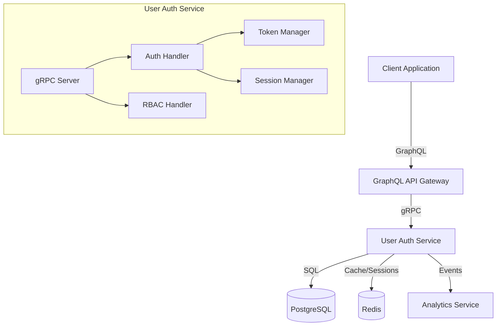

# Design Document: User Authentication Service

## Overview

The User Authentication Service is a Go-based microservice that provides secure authentication, authorization, and granular Role-Based Access Control (RBAC) for the HAUNTED SAAS SKELETON platform. It serves as the central authority for user identity, session management, and permission enforcement across all services in the system.

The service exposes gRPC endpoints for internal service-to-service communication and integrates with the GraphQL API Gateway for external client access. It leverages PostgreSQL for persistent storage of user accounts, roles, and permissions, while using Redis for high-performance session management and caching.

## Architecture

### High-Level Architecture



### Service Layers

The service follows a clean architecture pattern with the following layers:

1. **Transport Layer**: gRPC server handling incoming requests
2. **Handler Layer**: Business logic orchestration and request validation
3. **Service Layer**: Core authentication and authorization logic
4. **Repository Layer**: Data access abstractions for PostgreSQL and Redis
5. **Domain Layer**: Core entities and business rules

### Technology Stack

- **Language**: Go 1.21+
- **gRPC Framework**: `google.golang.org/grpc`
- **Database ORM**: GORM with pgx driver
- **JWT Library**: `github.com/golang-jwt/jwt/v5`
- **Password Hashing**: `golang.org/x/crypto/bcrypt`
- **Redis Client**: `github.com/redis/go-redis/v9`
- **Logging**: `go.uber.org/zap` for structured JSON logging
- **Configuration**: `github.com/spf13/viper`

## Components and Interfaces

### 1. gRPC Service Definition

```protobuf
syntax = "proto3";
package userauth.v1;

import "google/protobuf/timestamp.proto";

service UserAuthService {
  // Authentication
  rpc Register(RegisterRequest) returns (RegisterResponse);
  rpc Login(LoginRequest) returns (LoginResponse);
  rpc Logout(LogoutRequest) returns (LogoutResponse);
  rpc ValidateToken(ValidateTokenRequest) returns (ValidateTokenResponse);
  rpc RefreshSession(RefreshSessionRequest) returns (RefreshSessionResponse);
  
  // Password Management
  rpc RequestPasswordReset(PasswordResetRequest) returns (PasswordResetResponse);
  rpc ResetPassword(ResetPasswordRequest) returns (ResetPasswordResponse);
  
  // RBAC Management
  rpc CreateRole(CreateRoleRequest) returns (Role);
  rpc UpdateRole(UpdateRoleRequest) returns (Role);
  rpc DeleteRole(DeleteRoleRequest) returns (DeleteRoleResponse);
  rpc AssignRoleToUser(AssignRoleRequest) returns (AssignRoleResponse);
  rpc RevokeRoleFromUser(RevokeRoleRequest) returns (RevokeRoleResponse);
  
  // Authorization
  rpc CheckPermission(CheckPermissionRequest) returns (CheckPermissionResponse);
  rpc GetUserPermissions(GetUserPermissionsRequest) returns (GetUserPermissionsResponse);
}

message RegisterRequest {
  string email = 1;
  string password = 2;
  string name = 3;
}

message LoginRequest {
  string email = 1;
  string password = 2;
  string ip_address = 3;
}

message LoginResponse {
  string access_token = 1;
  string refresh_token = 2;
  User user = 3;
  google.protobuf.Timestamp expires_at = 4;
}

message CheckPermissionRequest {
  string user_id = 1;
  string permission = 2;
  string session_token = 3;
}

message CheckPermissionResponse {
  bool allowed = 1;
  string reason = 2;
}
```

### 2. Core Domain Models

#### User Entity
```go
type User struct {
    ID           string    `gorm:"primaryKey;type:uuid;default:gen_random_uuid()"`
    Email        string    `gorm:"uniqueIndex;not null"`
    PasswordHash string    `gorm:"not null"`
    Name         string    `gorm:"not null"`
    IsActive     bool      `gorm:"default:true"`
    IsLocked     bool      `gorm:"default:false"`
    LockedUntil  *time.Time
    CreatedAt    time.Time
    UpdatedAt    time.Time
    Roles        []Role `gorm:"many2many:user_roles;"`
}
```

#### Role Entity
```go
type Role struct {
    ID          string       `gorm:"primaryKey;type:uuid;default:gen_random_uuid()"`
    Name        string       `gorm:"uniqueIndex;not null"`
    Description string
    IsSystem    bool         `gorm:"default:false"` // System roles cannot be deleted
    CreatedAt   time.Time
    UpdatedAt   time.Time
    Permissions []Permission `gorm:"many2many:role_permissions;"`
}
```

#### Permission Entity
```go
type Permission struct {
    ID          string    `gorm:"primaryKey;type:uuid;default:gen_random_uuid()"`
    Name        string    `gorm:"uniqueIndex;not null"` // e.g., "users:read", "billing:write"
    Resource    string    `gorm:"not null"`             // e.g., "users", "billing"
    Action      string    `gorm:"not null"`             // e.g., "read", "write", "delete"
    Description string
    CreatedAt   time.Time
}
```

#### Session Entity (Redis)
```go
type Session struct {
    SessionID   string    `json:"session_id"`
    UserID      string    `json:"user_id"`
    TokenJTI    string    `json:"token_jti"` // JWT ID for revocation
    IPAddress   string    `json:"ip_address"`
    UserAgent   string    `json:"user_agent"`
    CreatedAt   time.Time `json:"created_at"`
    ExpiresAt   time.Time `json:"expires_at"`
    LastActivity time.Time `json:"last_activity"`
}
```

### 3. Repository Interfaces

```go
type UserRepository interface {
    Create(ctx context.Context, user *User) error
    FindByEmail(ctx context.Context, email string) (*User, error)
    FindByID(ctx context.Context, id string) (*User, error)
    Update(ctx context.Context, user *User) error
    GetUserRoles(ctx context.Context, userID string) ([]Role, error)
    AssignRole(ctx context.Context, userID, roleID string) error
    RevokeRole(ctx context.Context, userID, roleID string) error
}

type RoleRepository interface {
    Create(ctx context.Context, role *Role) error
    FindByID(ctx context.Context, id string) (*Role, error)
    FindByName(ctx context.Context, name string) (*Role, error)
    Update(ctx context.Context, role *Role) error
    Delete(ctx context.Context, id string) error
    GetRolePermissions(ctx context.Context, roleID string) ([]Permission, error)
    AssignPermission(ctx context.Context, roleID, permissionID string) error
}

type SessionRepository interface {
    Create(ctx context.Context, session *Session) error
    Get(ctx context.Context, sessionID string) (*Session, error)
    Delete(ctx context.Context, sessionID string) error
    DeleteAllForUser(ctx context.Context, userID string) error
    ExtendExpiration(ctx context.Context, sessionID string, duration time.Duration) error
    IsRevoked(ctx context.Context, tokenJTI string) (bool, error)
    RevokeToken(ctx context.Context, tokenJTI string, expiresAt time.Time) error
}

type PermissionCacheRepository interface {
    GetUserPermissions(ctx context.Context, userID string) ([]string, error)
    SetUserPermissions(ctx context.Context, userID string, permissions []string, ttl time.Duration) error
    InvalidateUserPermissions(ctx context.Context, userID string) error
}
```

### 4. Service Layer Components

#### AuthService
Handles core authentication operations:
- User registration with email validation and password hashing
- Login with credential verification and rate limiting
- JWT generation and validation
- Session management
- Password reset flow

```go
type AuthService interface {
    Register(ctx context.Context, email, password, name string) (*User, error)
    Login(ctx context.Context, email, password, ipAddress string) (*LoginResult, error)
    ValidateToken(ctx context.Context, token string) (*TokenClaims, error)
    Logout(ctx context.Context, sessionID, tokenJTI string) error
    LogoutAllDevices(ctx context.Context, userID string) error
    RequestPasswordReset(ctx context.Context, email string) (string, error)
    ResetPassword(ctx context.Context, token, newPassword string) error
}
```

#### RBACService
Manages roles, permissions, and authorization:
- Role CRUD operations
- Permission assignment to roles
- Role assignment to users
- Permission checking with caching
- Permission aggregation across multiple roles

```go
type RBACService interface {
    CreateRole(ctx context.Context, name, description string, permissions []string) (*Role, error)
    UpdateRole(ctx context.Context, roleID string, updates *RoleUpdate) (*Role, error)
    DeleteRole(ctx context.Context, roleID string) error
    AssignRoleToUser(ctx context.Context, userID, roleID string) error
    RevokeRoleFromUser(ctx context.Context, userID, roleID string) error
    CheckPermission(ctx context.Context, userID, permission string) (bool, error)
    GetUserPermissions(ctx context.Context, userID string) ([]string, error)
}
```

#### TokenManager
Manages JWT lifecycle:
- Token generation with RS256 signing
- Token validation and parsing
- Claims extraction
- Key rotation support

```go
type TokenManager interface {
    GenerateToken(user *User, roles []Role, sessionID string) (string, error)
    ValidateToken(token string) (*TokenClaims, error)
    ExtractClaims(token string) (*TokenClaims, error)
}

type TokenClaims struct {
    UserID      string   `json:"user_id"`
    Email       string   `json:"email"`
    SessionID   string   `json:"session_id"`
    Roles       []string `json:"roles"`
    Permissions []string `json:"permissions"`
    jwt.RegisteredClaims
}
```

### 5. Rate Limiting Component

Implements account lockout after failed login attempts:

```go
type RateLimiter interface {
    RecordFailedAttempt(ctx context.Context, email string) error
    IsLocked(ctx context.Context, email string) (bool, time.Duration, error)
    ResetAttempts(ctx context.Context, email string) error
}
```

Implementation uses Redis with sliding window:
- Key: `ratelimit:login:{email}`
- Value: Failed attempt count
- TTL: 15 minutes
- Lock threshold: 5 attempts
- Lock duration: 30 minutes

## Data Models

### Database Schema

```sql
-- Users table
CREATE TABLE users (
    id UUID PRIMARY KEY DEFAULT gen_random_uuid(),
    email VARCHAR(255) UNIQUE NOT NULL,
    password_hash VARCHAR(255) NOT NULL,
    name VARCHAR(255) NOT NULL,
    is_active BOOLEAN DEFAULT true,
    is_locked BOOLEAN DEFAULT false,
    locked_until TIMESTAMP,
    created_at TIMESTAMP DEFAULT CURRENT_TIMESTAMP,
    updated_at TIMESTAMP DEFAULT CURRENT_TIMESTAMP
);

-- Roles table
CREATE TABLE roles (
    id UUID PRIMARY KEY DEFAULT gen_random_uuid(),
    name VARCHAR(100) UNIQUE NOT NULL,
    description TEXT,
    is_system BOOLEAN DEFAULT false,
    created_at TIMESTAMP DEFAULT CURRENT_TIMESTAMP,
    updated_at TIMESTAMP DEFAULT CURRENT_TIMESTAMP
);

-- Permissions table
CREATE TABLE permissions (
    id UUID PRIMARY KEY DEFAULT gen_random_uuid(),
    name VARCHAR(100) UNIQUE NOT NULL,
    resource VARCHAR(50) NOT NULL,
    action VARCHAR(50) NOT NULL,
    description TEXT,
    created_at TIMESTAMP DEFAULT CURRENT_TIMESTAMP
);

-- User-Role junction table
CREATE TABLE user_roles (
    user_id UUID REFERENCES users(id) ON DELETE CASCADE,
    role_id UUID REFERENCES roles(id) ON DELETE CASCADE,
    assigned_at TIMESTAMP DEFAULT CURRENT_TIMESTAMP,
    PRIMARY KEY (user_id, role_id)
);

-- Role-Permission junction table
CREATE TABLE role_permissions (
    role_id UUID REFERENCES roles(id) ON DELETE CASCADE,
    permission_id UUID REFERENCES permissions(id) ON DELETE CASCADE,
    PRIMARY KEY (role_id, permission_id)
);

-- Indexes
CREATE INDEX idx_users_email ON users(email);
CREATE INDEX idx_users_active ON users(is_active);
CREATE INDEX idx_user_roles_user ON user_roles(user_id);
CREATE INDEX idx_user_roles_role ON user_roles(role_id);
CREATE INDEX idx_role_permissions_role ON role_permissions(role_id);
```

### Redis Data Structures

#### Sessions
- Key pattern: `session:{session_id}`
- Type: Hash
- TTL: 24 hours (sliding window)
- Fields: user_id, token_jti, ip_address, created_at, expires_at, last_activity

#### Token Revocation List
- Key pattern: `revoked:{token_jti}`
- Type: String (value: "1")
- TTL: Matches original token expiration

#### Permission Cache
- Key pattern: `permissions:{user_id}`
- Type: Set
- TTL: 5 minutes
- Members: Permission strings (e.g., "users:read", "billing:write")

#### Rate Limiting
- Key pattern: `ratelimit:login:{email}`
- Type: String (counter)
- TTL: 15 minutes

#### Password Reset Tokens
- Key pattern: `reset:{hashed_token}`
- Type: Hash
- TTL: 1 hour
- Fields: user_id, email, created_at

## Error Handling

### Error Types

```go
type ErrorCode string

const (
    ErrCodeInvalidCredentials   ErrorCode = "INVALID_CREDENTIALS"
    ErrCodeUserNotFound         ErrorCode = "USER_NOT_FOUND"
    ErrCodeEmailAlreadyExists   ErrorCode = "EMAIL_ALREADY_EXISTS"
    ErrCodeInvalidToken         ErrorCode = "INVALID_TOKEN"
    ErrCodeExpiredToken         ErrorCode = "EXPIRED_TOKEN"
    ErrCodeRevokedToken         ErrorCode = "REVOKED_TOKEN"
    ErrCodeAccountLocked        ErrorCode = "ACCOUNT_LOCKED"
    ErrCodePermissionDenied     ErrorCode = "PERMISSION_DENIED"
    ErrCodeInvalidInput         ErrorCode = "INVALID_INPUT"
    ErrCodeRoleNotFound         ErrorCode = "ROLE_NOT_FOUND"
    ErrCodeSystemRoleProtected  ErrorCode = "SYSTEM_ROLE_PROTECTED"
    ErrCodeInternal             ErrorCode = "INTERNAL_ERROR"
)

type ServiceError struct {
    Code    ErrorCode
    Message string
    Details map[string]interface{}
}
```

### gRPC Error Mapping

```go
func MapToGRPCError(err error) error {
    if err == nil {
        return nil
    }
    
    serviceErr, ok := err.(*ServiceError)
    if !ok {
        return status.Error(codes.Internal, "internal server error")
    }
    
    switch serviceErr.Code {
    case ErrCodeInvalidCredentials, ErrCodeInvalidToken:
        return status.Error(codes.Unauthenticated, serviceErr.Message)
    case ErrCodePermissionDenied:
        return status.Error(codes.PermissionDenied, serviceErr.Message)
    case ErrCodeUserNotFound, ErrCodeRoleNotFound:
        return status.Error(codes.NotFound, serviceErr.Message)
    case ErrCodeEmailAlreadyExists:
        return status.Error(codes.AlreadyExists, serviceErr.Message)
    case ErrCodeInvalidInput:
        return status.Error(codes.InvalidArgument, serviceErr.Message)
    default:
        return status.Error(codes.Internal, "internal server error")
    }
}
```

### Error Handling Strategy

1. **Authentication Errors**: Return generic messages to prevent user enumeration
2. **Validation Errors**: Return specific field-level errors for client feedback
3. **Authorization Errors**: Log detailed context but return minimal information to client
4. **Internal Errors**: Log full stack traces, return generic error to client
5. **Rate Limiting**: Return time until unlock in error details

## Testing Strategy

### Unit Testing

Focus on core business logic with table-driven tests:

```go
func TestAuthService_Login(t *testing.T) {
    tests := []struct {
        name          string
        email         string
        password      string
        setupMock     func(*mocks.UserRepository, *mocks.SessionRepository)
        expectedError error
    }{
        {
            name:     "successful login",
            email:    "user@example.com",
            password: "ValidPass123!",
            setupMock: func(ur *mocks.UserRepository, sr *mocks.SessionRepository) {
                // Mock setup
            },
            expectedError: nil,
        },
        // Additional test cases...
    }
    
    for _, tt := range tests {
        t.Run(tt.name, func(t *testing.T) {
            // Test implementation
        })
    }
}
```

Test coverage targets:
- AuthService: >85%
- RBACService: >85%
- TokenManager: >90%
- Repositories: >80%
- Handlers: >75%

### Integration Testing

Test database interactions and Redis operations:
- Use testcontainers for PostgreSQL and Redis
- Test transaction handling and rollbacks
- Verify cache invalidation logic
- Test concurrent session operations

### End-to-End Testing

Test complete authentication flows via gRPC:
- Registration → Login → Token Validation
- Login → Permission Check → Logout
- Failed Login → Account Lock → Unlock
- Password Reset flow
- Role Assignment → Permission Check

### Security Testing

- Password strength validation
- SQL injection prevention (parameterized queries)
- JWT signature verification
- Token expiration enforcement
- Session hijacking prevention
- Rate limiting effectiveness

## Security Considerations

### Password Security
- Bcrypt with cost factor 12
- Minimum password requirements enforced at service layer
- Password history to prevent reuse (future enhancement)

### Token Security
- RS256 algorithm (asymmetric signing)
- Short-lived access tokens (24 hours)
- Token revocation list for logout
- JTI (JWT ID) for unique token identification

### Session Security
- Secure session ID generation (crypto/rand)
- IP address tracking for anomaly detection
- Session expiration with sliding window
- Concurrent session limits (future enhancement)

### RBAC Security
- System roles protected from deletion
- Permission checks cached with short TTL
- Cache invalidation on role changes
- Audit logging for all RBAC operations

### Network Security
- TLS for all gRPC communication
- mTLS for service-to-service auth (future enhancement)
- API rate limiting at gateway level

## Integration Points

### Analytics Service Integration

Emit events for security monitoring and user behavior analysis:

```go
type AuthEvent struct {
    EventType   string    `json:"event_type"`
    UserID      string    `json:"user_id,omitempty"`
    Email       string    `json:"email,omitempty"`
    IPAddress   string    `json:"ip_address"`
    Timestamp   time.Time `json:"timestamp"`
    Success     bool      `json:"success"`
    ErrorReason string    `json:"error_reason,omitempty"`
    Metadata    map[string]interface{} `json:"metadata,omitempty"`
}
```

Events to emit:
- `user.registered`
- `user.login.success`
- `user.login.failed`
- `user.logout`
- `user.password_reset.requested`
- `user.password_reset.completed`
- `user.role.assigned`
- `user.role.revoked`
- `user.account.locked`

### GraphQL Gateway Integration

The gateway will translate GraphQL mutations/queries to gRPC calls:

```graphql
type Mutation {
  register(input: RegisterInput!): AuthPayload!
  login(input: LoginInput!): AuthPayload!
  logout: Boolean!
  requestPasswordReset(email: String!): Boolean!
  resetPassword(token: String!, newPassword: String!): Boolean!
}

type Query {
  me: User!
  checkPermission(permission: String!): Boolean!
}
```

## Deployment Considerations

### Configuration Management

Use environment variables and Viper for configuration:

```go
type Config struct {
    Server struct {
        GRPCPort int
        Host     string
    }
    Database struct {
        Host     string
        Port     int
        Name     string
        User     string
        Password string
    }
    Redis struct {
        Host     string
        Port     int
        Password string
        DB       int
    }
    JWT struct {
        PrivateKeyPath string
        PublicKeyPath  string
        Expiration     time.Duration
    }
    Security struct {
        BcryptCost        int
        MaxLoginAttempts  int
        LockoutDuration   time.Duration
        PermissionCacheTTL time.Duration
    }
}
```

### Health Checks

Implement gRPC health check protocol:
- Database connectivity check
- Redis connectivity check
- Service readiness indicator

### Observability

- Structured JSON logging with correlation IDs
- Prometheus metrics for authentication rates, errors, latency
- Distributed tracing with OpenTelemetry
- Key metrics:
  - Login success/failure rates
  - Token validation latency
  - Permission check cache hit rate
  - Active session count

### Docker Configuration

```dockerfile
FROM golang:1.21-alpine AS builder
WORKDIR /app
COPY go.mod go.sum ./
RUN go mod download
COPY . .
RUN CGO_ENABLED=0 GOOS=linux go build -o user-auth-service ./cmd/server

FROM alpine:latest
RUN apk --no-cache add ca-certificates
WORKDIR /root/
COPY --from=builder /app/user-auth-service .
COPY --from=builder /app/keys ./keys
EXPOSE 50051
CMD ["./user-auth-service"]
```

## Future Enhancements

1. **Multi-Factor Authentication (MFA)**: TOTP-based 2FA support
2. **OAuth2/OIDC Provider**: Allow external services to authenticate via this service
3. **Social Login**: Integration with Google, GitHub, etc.
4. **Passwordless Authentication**: Magic links and WebAuthn support
5. **Advanced RBAC**: Attribute-Based Access Control (ABAC) for fine-grained permissions
6. **Session Management UI**: Allow users to view and revoke active sessions
7. **Audit Log Query API**: Expose authentication audit logs via gRPC
8. **Anomaly Detection**: ML-based detection of suspicious login patterns
