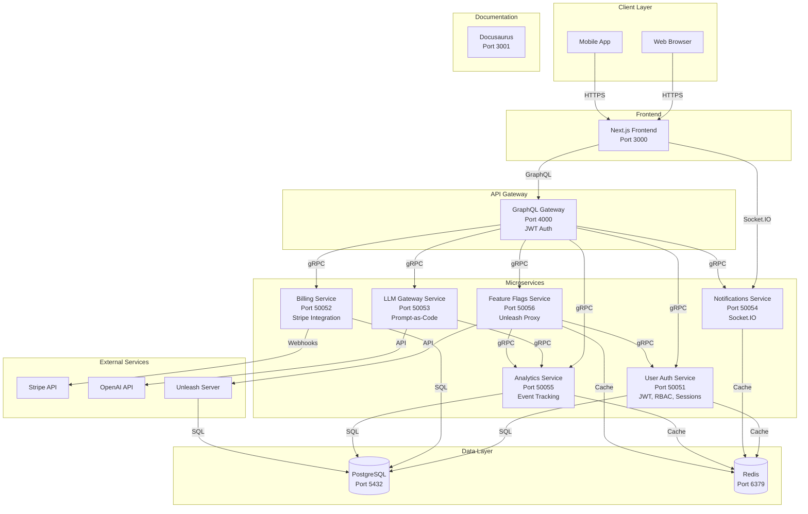
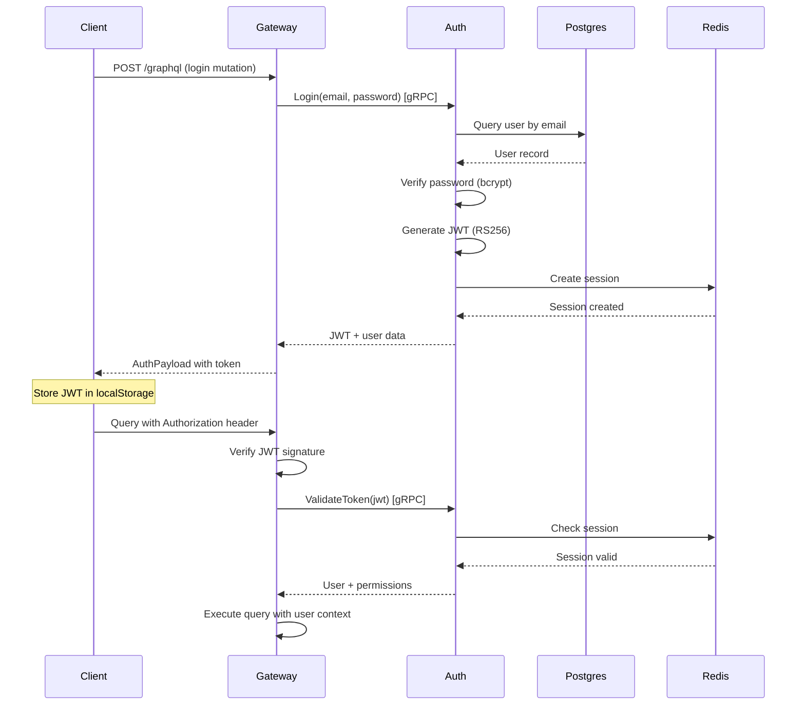
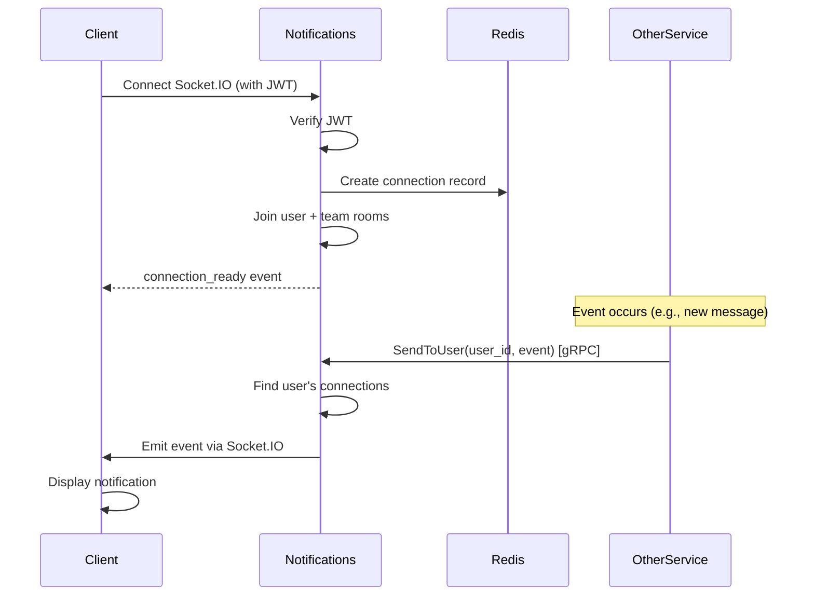
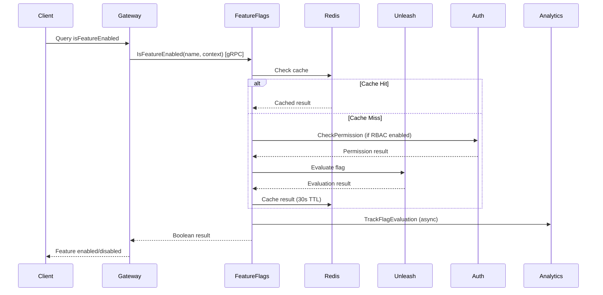
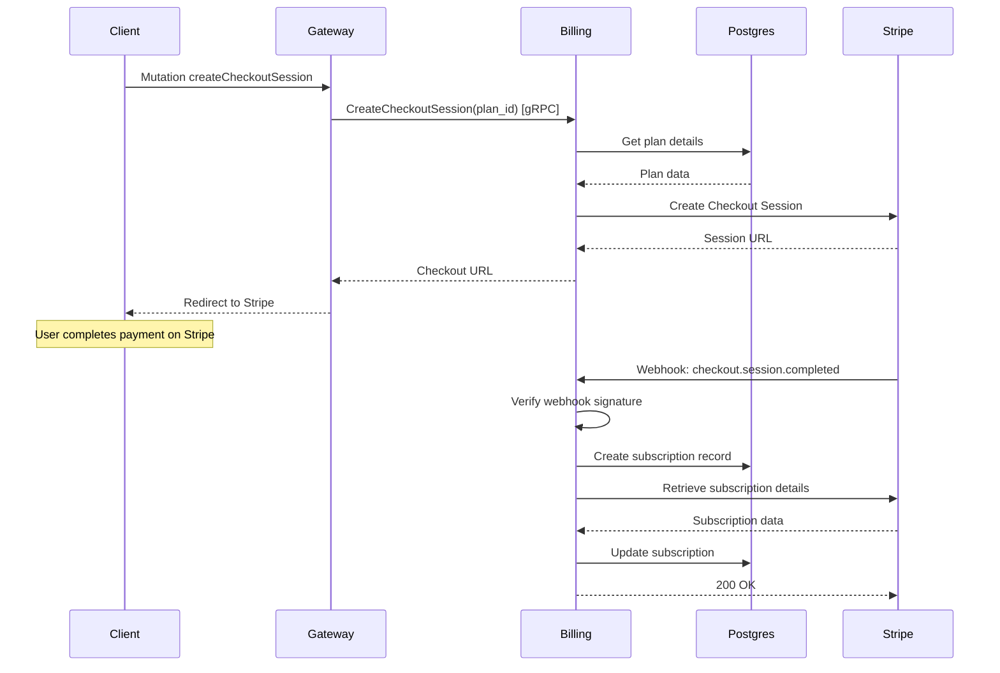
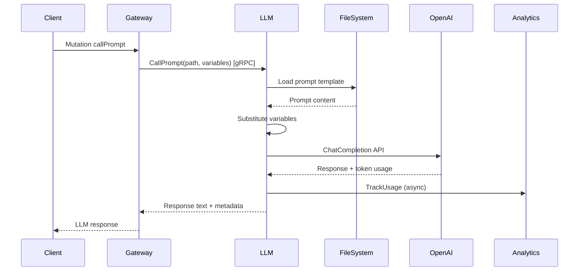
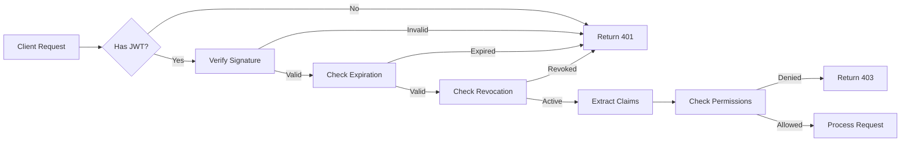

# HAUNTED SAAS SKELETON - Architecture

## System Overview



## Service Communication Matrix

| Service | Calls | Called By | Protocol |
|---------|-------|-----------|----------|
| **User Auth** | PostgreSQL, Redis | GraphQL Gateway, Feature Flags | gRPC |
| **Billing** | PostgreSQL, Stripe | GraphQL Gateway | gRPC, HTTP (webhooks) |
| **LLM Gateway** | OpenAI, Analytics | GraphQL Gateway | gRPC |
| **Notifications** | Redis | GraphQL Gateway, All Services | gRPC, Socket.IO |
| **Analytics** | PostgreSQL, Redis | All Services | gRPC |
| **Feature Flags** | Unleash, Redis, Auth, Analytics | GraphQL Gateway, All Services | gRPC |

## Data Flow Diagrams

### Authentication Flow



### Real-time Notification Flow



### Feature Flag Evaluation Flow



### Billing Subscription Flow



### LLM Prompt Execution Flow



## Technology Stack

### Backend Services (Go)
- **Language**: Go 1.21+
- **gRPC**: google.golang.org/grpc
- **Database**: PostgreSQL 15 with GORM
- **Cache**: Redis 7
- **JWT**: github.com/golang-jwt/jwt/v5
- **Password**: golang.org/x/crypto/bcrypt
- **Logging**: go.uber.org/zap
- **Config**: github.com/spf13/viper

### Frontend (TypeScript)
- **Framework**: Next.js 14+ (App Router)
- **Language**: TypeScript
- **Styling**: Tailwind CSS
- **GraphQL**: Apollo Client or urql
- **Real-time**: Socket.IO client
- **Forms**: React Hook Form + Zod
- **Testing**: Jest + React Testing Library

### Infrastructure
- **Containerization**: Docker + Docker Compose
- **CI/CD**: GitHub Actions
- **Monitoring**: Prometheus + Grafana (planned)
- **Logging**: Structured JSON logs
- **Tracing**: OpenTelemetry (planned)

### External Services
- **Payments**: Stripe
- **LLM**: OpenAI
- **Feature Flags**: Unleash (self-hosted)

## Security Architecture

### Authentication & Authorization



### Security Layers

1. **Transport Security**
   - TLS/HTTPS for all external communication
   - mTLS for service-to-service (optional)

2. **Authentication**
   - JWT with RS256 (asymmetric signing)
   - 24-hour token expiration
   - Session management in Redis
   - Token revocation list

3. **Authorization**
   - Role-Based Access Control (RBAC)
   - Granular permissions (resource:action)
   - Permission caching (5 min TTL)

4. **Data Protection**
   - bcrypt password hashing (cost 12)
   - PII encryption at rest
   - Sensitive data sanitization in logs

5. **Rate Limiting**
   - Account lockout (5 attempts = 30 min)
   - API rate limiting per user
   - Connection limits (10,000 concurrent)

6. **Input Validation**
   - Request validation at gateway
   - SQL injection prevention (parameterized queries)
   - XSS prevention (output encoding)

## Scalability Patterns

### Horizontal Scaling

All services are stateless and can scale horizontally:

```
┌─────────────┐
│   Load      │
│  Balancer   │
└──────┬──────┘
       │
   ┌───┴───┬───────┬───────┐
   │       │       │       │
┌──▼──┐ ┌──▼──┐ ┌──▼──┐ ┌──▼──┐
│Svc 1│ │Svc 2│ │Svc 3│ │Svc N│
└──┬──┘ └──┬──┘ └──┬──┘ └──┬──┘
   │       │       │       │
   └───┬───┴───────┴───────┘
       │
   ┌───▼────┐
   │ Redis  │
   │Cluster │
   └────────┘
```

### Caching Strategy

1. **Session Cache** (Redis)
   - TTL: 24 hours (sliding window)
   - Invalidation: On logout or role change

2. **Permission Cache** (Redis)
   - TTL: 5 minutes
   - Invalidation: On role/permission change

3. **Feature Flag Cache** (Redis)
   - TTL: 30 seconds
   - Invalidation: On flag update

4. **Analytics Aggregation Cache** (Redis)
   - TTL: 5 minutes
   - Invalidation: Time-based

### Database Optimization

1. **Connection Pooling**
   - Max 25 connections per service
   - Connection reuse

2. **Indexes**
   - User email (unique)
   - Session user_id
   - Event timestamp
   - Subscription team_id

3. **Query Optimization**
   - Prepared statements
   - Batch inserts
   - Pagination

## Deployment Architecture

### Development
```
Docker Compose
├── PostgreSQL
├── Redis
├── Unleash
└── All Services (local build)
```

### Production (Kubernetes)
```
┌─────────────────────────────────────┐
│           Ingress Controller         │
│         (TLS Termination)            │
└────────────┬────────────────────────┘
             │
    ┌────────┴────────┐
    │                 │
┌───▼────┐      ┌────▼─────┐
│Frontend│      │ Gateway  │
│  Pod   │      │   Pod    │
└───┬────┘      └────┬─────┘
    │                │
    └────────┬───────┘
             │
    ┌────────┴────────────────────┐
    │                             │
┌───▼────┐  ┌────────┐  ┌────────▼┐
│ Auth   │  │Billing │  │  Other  │
│  Pod   │  │  Pod   │  │Services │
└───┬────┘  └───┬────┘  └────┬────┘
    │           │            │
    └───────┬───┴────────────┘
            │
    ┌───────┴────────┐
    │                │
┌───▼────┐    ┌─────▼──┐
│Postgres│    │ Redis  │
│Cluster │    │Cluster │
└────────┘    └────────┘
```

## Monitoring & Observability

### Metrics (Prometheus)
- Request rate, latency, errors
- Connection counts
- Cache hit rates
- Database query performance
- Token generation/validation rates

### Logging (Structured JSON)
- Request/response logs
- Error logs with stack traces
- Audit logs (auth events)
- Performance logs (slow queries)

### Tracing (OpenTelemetry)
- Distributed request tracing
- Service dependency mapping
- Performance bottleneck identification

### Alerting
- Service health
- Error rate thresholds
- Database connection issues
- Cache failures
- External API failures

## Disaster Recovery

### Backup Strategy
- **Database**: Daily automated backups
- **Redis**: AOF persistence + snapshots
- **Configuration**: Version controlled
- **Keys**: Secure key management service

### Recovery Procedures
1. Database restore from backup
2. Redis restore from snapshot
3. Service redeployment
4. Configuration restoration
5. Verification testing

---

**Architecture Version**: 1.0
**Last Updated**: 2025-01-11
**Status**: Foundation complete, ready for implementation
