# Microservice Architecture

Haunted SaaS is built using a modern microservice architecture that provides scalability, maintainability, and flexibility. This document explains our architectural decisions, patterns, and trade-offs.

## Architecture Overview

```mermaid
graph TB
    subgraph "Client Layer"
        Web["🖥️ Web App<br/>(Next.js)"]
        Mobile["📱 Mobile App<br/>(React Native)"]
        API["🔌 Third-party<br/>Integrations"]
    end
    
    subgraph "API Gateway Layer"
        Gateway["🌐 GraphQL Gateway<br/>Port 8080"]
    end
    
    subgraph "Service Layer"
        Auth["🔐 User Auth<br/>Port 8081"]
        Billing["💳 Billing<br/>Port 8082"]
        Analytics["📊 Analytics<br/>Port 8083"]
        LLM["🤖 LLM Gateway<br/>Port 8084"]
        Notifications["🔔 Notifications<br/>Port 8085"]
        FeatureFlags["🚩 Feature Flags<br/>Port 8086"]
    end
    
    subgraph "Data Layer"
        Postgres[("🗄️ PostgreSQL<br/>Primary Database")]
        Redis[("📦 Redis<br/>Cache & Sessions")]
    end
    
    Web --> Gateway
    Mobile --> Gateway
    API --> Gateway
    
    Gateway --> Auth
    Gateway --> Billing
    Gateway --> Analytics
    Gateway --> LLM
    Gateway --> Notifications
    Gateway --> FeatureFlags
    
    Auth --> Postgres
    Billing --> Postgres
    Analytics --> Redis
    Notifications --> Redis
```

## Design Principles

### 1. Domain-Driven Design (DDD)

Each service represents a bounded context with clear domain boundaries and responsibilities.

### 2. Single Responsibility

Each service focuses on one business capability, making the system easier to understand, develop, and scale.

### 3. API-First Design

All services expose well-defined APIs using gRPC for internal communication and GraphQL for external clients.

### 4. Data Ownership

Each service owns its data and exposes it through APIs, preventing tight coupling through shared databases.

## Service Communication

### gRPC for Internal Communication

Services communicate via gRPC for performance, type safety, and streaming capabilities.

### GraphQL Gateway Pattern

The GraphQL Gateway aggregates data from multiple services, providing a unified API for clients while handling authentication, caching, and rate limiting.

### Event-Driven Architecture

Services publish events for loose coupling, enabling asynchronous communication and better scalability.

## Resilience Patterns

- **Circuit Breaker**: Prevents cascading failures
- **Retry with Backoff**: Handles transient failures
- **Timeout Management**: Prevents resource exhaustion
- **Graceful Degradation**: Maintains partial functionality

## Scalability Considerations

- **Horizontal Scaling**: Services can scale independently
- **Caching Strategy**: Redis for session and frequently accessed data
- **Database Optimization**: Connection pooling and query optimization
- **Load Balancing**: Distribute traffic across service instances

---

This architecture enables Haunted SaaS to scale efficiently while maintaining code quality and developer productivity.
